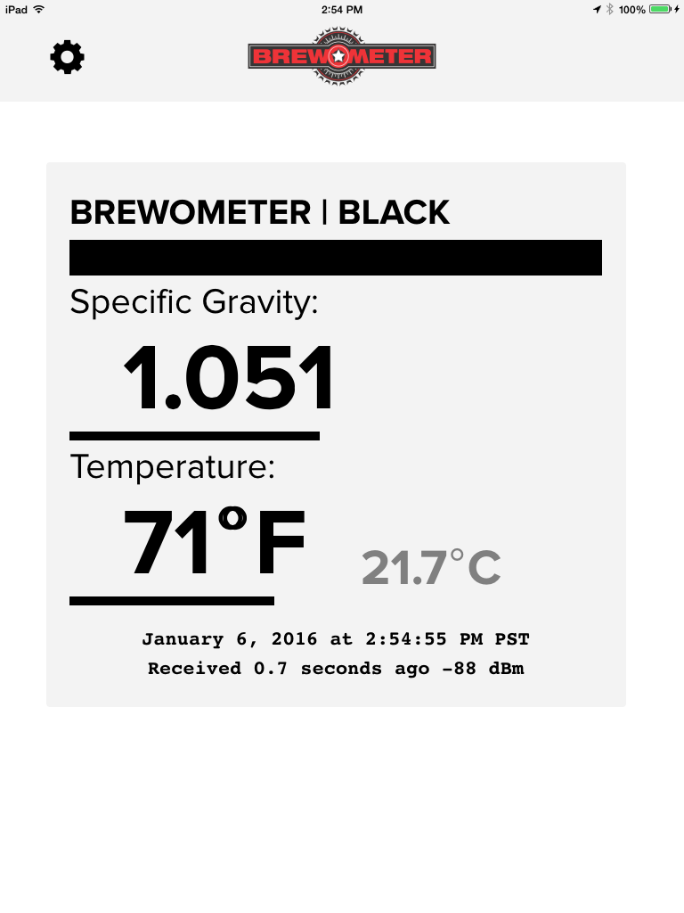

# brewometer-cordova

The Brewometer is a wireless thermometer and hydrometer that sends sensor data to an iOS or Android device in the major and minor ids like an iBeacon.

http://brewometer.net

This is the hybrid app (cordova) for reading data from the Brewometer on both iOS and Android platforms.

